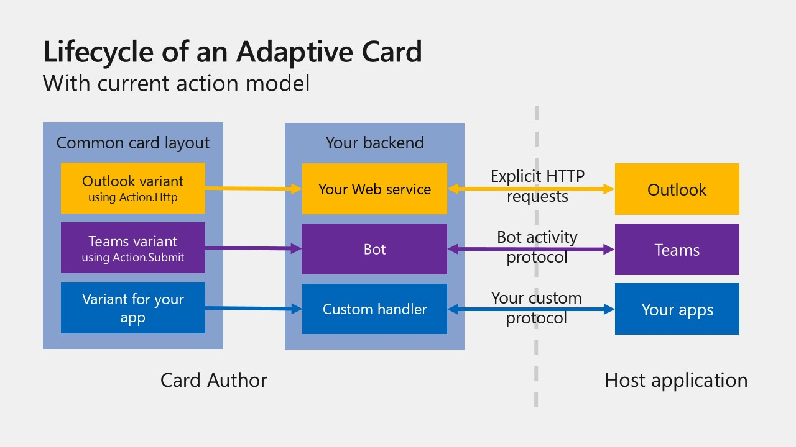

# Adaptive Cards V2 documentation

# Context

Adaptive Cards are platform-agnostic snippets of UI, sent as JSON, that apps and services can share. See [adaptivecards.io](http://adaptivecards.io) for more information on Adaptive Cards. Adaptive cards not only adapt to the look-and-feel of the host, but also provide rich interaction capabilities.

As Adaptive Cards grew in popularity, different hosts started supporting different action models and this led to fragmentation.

Adaptive Cards v2 is an effort to consolidate these actions with a single action model named `Action.Execute`

Before Adaptive Cards v2            |  With Adaptive Cards v2
:-------------------------:|:-------------------------:
 | 

Source: [Adaptive Cards @ Microsoft Build 2020](https://youtu.be/hEBhwB72Qn4?t=1393)

## Schema

Old Action Model            |  New Action Model
:-------------------------:|:-------------------------:
 | 


### Action.Execute
`Action.Execute` is the action that replaces `Action.Submit` in Adaptive Cards v2. The schema for `Action.Execute` is quite similar to that of `Action.Submit`

**Example JSON**
```json
{
  "$schema": "http://adaptivecards.io/schemas/adaptive-card.json",
  "type": "AdaptiveCard",
  "version": "1.0",
  "body": [
    {
      "type": "TextBlock",
      "text": "Present a form and submit it back to the originator"
    },
    {
      "type": "Input.Text",
      "id": "firstName",
      "placeholder": "What is your first name?"
    },
    {
      "type": "Input.Text",
      "id": "lastName",
      "placeholder": "What is your last name?"
    }
  ],
  "actions": [
    {
      "type": "Action.Execute",
      "title": "Submit",
      "verb": "personalDetailsFormSubmit"
    }
  ]
}
```

**Properties**

| Property | Type | Required | Description 
| -------- | ---- | -------- | ----------- 
| **type** | `"Action.Execute"` | Yes | Must be `"Action.Execute"`. |
| **verb** | string | No | A convenience string that can be used by developer to identify the action 

Rest of the properties are similar to those of `Action.Submit`. See the [documentation](https://adaptivecards.io/explorer/Action.Submit.html) for more details. They are listed down below for reference -

**Inherited properties**

| Property | Type | Required | Description | Version |
| -------- | ---- | -------- | ----------- | ------- |
| **data** | `string`, `object` | No | Initial data that input fields will be combined with. These are essentially ‘hidden’ properties. | 1.0 |
| **title** | `string` | No | Label for button or link that represents this action. | 1.0 |
| **iconUrl** | `uri` | No | Optional icon to be shown on the action in conjunction with the title. Supports data URI in version 1.2+ | 1.1 |
| **style** | `ActionStyle` | No | Controls the style of an Action, which influences how the action is displayed, spoken, etc. | 1.2 |
| **fallback** | `Action`, `FallbackOption` | No | Describes what to do when Action.Execute is unsupported | 1.2 |
| **requires** | `Dictionary<string>` | No | A series of key/value pairs indicating features that the item requires with corresponding minimum version. When a feature is missing or of insufficient version, fallback is triggered. | 1.2 |


### Auto Refresh

Auto Refresh ensures that the users have a consistent experience by fetching the latest state of the card before showing it to the user. It is recommended that you  include refresh section whenever you use `Action.Execute` in the card.

Refresh contains an action property `action`  of type `Action.Execute` and `userIds` property - an array of user IDs for who the auto refresh is enabled.

The size of `userIds` should not exceed 5 as per current limit.

| Property | Type | Required | Description 
| -------- | ---- | -------- | ----------- 
| **action** | `"Action.Execute"` | Yes | Must be an action instance of type `"Action.Execute"`. |
| **userIds** | `Array<string>` | Yes | An array of `MRI`s of users for whom Auto Refresh must be enabled |

**Sample JSON**
```JSON
{
  "$schema": "http://adaptivecards.io/schemas/adaptive-card.json",
  "type": "AdaptiveCard",
  "version": "1.0",
  "refresh": {
    "action": {
      "type": "Action.Execute",
      "title": "Submit",
      "verb": "personalDetailsCardRefresh"
    },
    "userIds": []
  }
  "body": [
    {
      "type": "TextBlock",
      "text": "Present a form and submit it back to the originator"
    },
    {
      "type": "Input.Text",
      "id": "firstName",
      "placeholder": "What is your first name?"
    },
    {
      "type": "Input.Text",
      "id": "lastName",
      "placeholder": "What is your last name?"
    }
  ],
  "actions": [
    {
      "type": "Action.Execute",
      "title": "Submit",
      "verb": "personalDetailsFormSubmit"
    }
  ]
}
```

### `adaptiveCard/action` Invoke request and response formats

As part of the invoke request, you get the following information

```JSONc
{ 
  
// ... In addition to other Invoke request parameters,
// you'd receive the following

// name is always "adaptiveCard/action"
    "name": "adaptiveCard/action",  

    "value": { 

        "action": { 

            "type": "Action.Execute", 

            "id": "abc", 

            "data": { ... } 

        },

        "trigger": "automatic | manual" 

    }
} 
```

### Bot Response

```JSONC
{ 

    “statusCode”: <number (200 – 599)>, 

    “type”: <string>, 

    “value”: <object> 

} 
```

| Field | Description |
| -------- | ----------- |
| **statusCode** | This field is a number ranging from 200-599 that mirrors HttpStatusCode values and is meant to be a sub-status for the result of the bot processing the Invoke. A missing, null, or undefined value for statusCode implies a 200 (Success).   |
| **type** | A set of well-known string constants that describe the expected shape of the value property  |
| **value** | An object that is specific to the type of response body  |


**Valid response - statusCode = 200**
| statusCode| type | typeof(value) |
| ----------| ---- | ----------- |
| 200 \| undefined \| null | application/vnd.microsoft.activity.message | \<string\> |
| 200 \| undefined \| null | application/vnd.microsoft.card.adaptive | \<AdaptiveCard\> |


    Note: Responses for other `statusCodes` to be added


## Steps to leverage Adaptive Card v2 features

1. Use `Action.Execute` instead of `Action.Submit`. Replace all `Action.Submit` instances where you need role based views with `Action.Execute` 
2. Put a refresh property in the Adaptive Card payload to handle refresh requests. This allows you to give the latest state of the card always when the user sees it.
3. Be sure to include a limited list of users (< 5) who need the ability to automatically refresh their card. 
4. Handle the `adaptiveCard/action` request that Teams client sends when user takes an action on the card or autorefresh request
5. Use the request context to create an appropriate Adaptive Card for the user. Send the card according to the response schema mentioned above.
